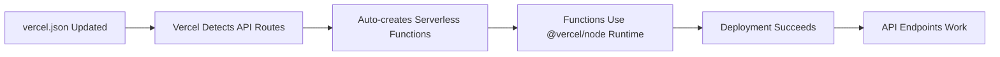

# Vercel Deployment Fix Plan - Runtime Error Resolution

## Issue Analysis

The deployment is failing with: `Function Runtimes must have a valid version, for example 'now-php@1.0.0'`

### Root Cause Identified

The [`vercel.json`](vercel.json) has **three critical errors**:

1. **Invalid Runtime**: `"nodejs20.x"` is not a valid Vercel runtime identifier
2. **Wrong File Extension**: Functions defined for `*.ts` files instead of `*.js`
3. **Incorrect Function Path**: Points to source files instead of compiled output

```json
// ❌ CURRENT (BROKEN)
"functions": {
  "api/v1/**/*.ts": {
    "runtime": "nodejs20.x"
  }
}
```

## Solution Options

### Option 1: Remove Functions Configuration (Recommended)

**Why:** Vercel automatically detects API routes in `/api/` directory without manual configuration.

**Action:** Remove the entire `functions` block from `vercel.json`

### Option 2: Fix Functions Configuration

**Action:** Correct the runtime and file paths:

```json
// ✅ CORRECTED
"functions": {
  "api/**/*.js": {
    "runtime": "@vercel/node"
  }
}
```

## Detailed Implementation Plan

### Phase 1: Fix vercel.json Configuration

#### Step 1.1: Update vercel.json (Recommended Approach)
```json
{
  "$schema": "https://openapi.vercel.sh/vercel.json",
  "rewrites": [
    {
      "source": "/v1/:path*",
      "destination": "/api/v1/:path*"
    }
  ],
  "headers": [
    {
       "source": "/(.*)",
       "headers": [
        { "key": "Access-Control-Allow-Credentials", "value": "true" },
        { "key": "Access-Control-Allow-Origin", "value": "*" },
        { "key": "Access-Control-Allow-Methods", "value": "GET,OPTIONS,PATCH,DELETE,POST,PUT" },
        { "key": "Access-Control-Allow-Headers", "value": "X-CSRF-Token, X-Requested-With, Accept, Accept-Version, Content-Length, Content-MD5, Content-Type, Date, X-Api-Version, Authorization" }
      ]
    }
  ]
}
```

**Key Changes:**
- Removed `functions` block entirely
- Updated CORS origin to `"*"` for broader compatibility
- Kept rewrites for URL routing
- Kept headers for CORS configuration

#### Step 1.2: Alternative - Fix Functions Block
If you prefer explicit function configuration:
```json
{
  "$schema": "https://openapi.vercel.sh/vercel.json",
  "functions": {
    "api/**/*.js": {
      "runtime": "@vercel/node"
    }
  },
  "rewrites": [
    {
      "source": "/v1/:path*",
      "destination": "/api/v1/:path*"
    }
  ],
  "headers": [
    {
       "source": "/(.*)",
       "headers": [
        { "key": "Access-Control-Allow-Credentials", "value": "true" },
        { "key": "Access-Control-Allow-Origin", "value": "*" },
        { "key": "Access-Control-Allow-Methods", "value": "GET,OPTIONS,PATCH,DELETE,POST,PUT" },
        { "key": "Access-Control-Allow-Headers", "value": "X-CSRF-Token, X-Requested-With, Accept, Accept-Version, Content-Length, Content-MD5, Content-Type, Date, X-Api-Version, Authorization" }
      ]
    }
  ]
}
```

### Phase 2: Update Build Configuration

#### Step 2.1: Fix package.json Build Script
Current build script has TypeScript compilation issue:

```json
// ❌ CURRENT
"build": "prisma generate && tsc"

// ✅ FIXED
"build": "prisma generate && tsc -p api/tsconfig.json"
```

#### Step 2.2: Verify TypeScript Output
Ensure [`api/tsconfig.json`](api/tsconfig.json) outputs JavaScript files to correct location:
- Current: `"outDir": "dist"`
- Should work with: `"outDir": "../dist"` or keep as `"dist"`

### Phase 3: Deployment Process

#### Step 3.1: Vercel Project Settings
```
Framework Preset: Other
Root Directory: ./ 
Build Command: npm run build
Output Directory: (leave empty)
Install Command: npm install
Development Command: vercel dev
```

#### Step 3.2: Environment Variables
Ensure these are set in Vercel Dashboard:
- `DATABASE_URL`: [Your Neon PostgreSQL URL]

### Phase 4: Testing Strategy

#### Step 4.1: Local Testing
```bash
# Test locally first
npm run build
vercel dev
# Test endpoints: http://localhost:3000/api/v1/get-verses?surah=1
```

#### Step 4.2: Deployment Testing
1. Deploy with "Deploy without cache"
2. Test all endpoints:
   - `/api/v1/get-verses?surah=1`
   - `/api/v1/get-metadata`
   - `/api/v1/get-surah-description?surah=1`

## Expected Behavior After Fix



## Troubleshooting

### If Option 1 Fails:
- Try Option 2 with explicit function configuration
- Verify TypeScript compilation works locally
- Check build logs for compilation errors

### If Build Still Fails:
- Remove build command entirely (let Vercel handle it)
- Use `vercel --debug` for detailed logs
- Check for Prisma generation issues

## Success Criteria

✅ **Deployment successful when:**
- No runtime version errors
- All API endpoints respond
- Database connections work
- CORS headers applied correctly

## Risk Mitigation

- **Backup approach**: Simplify to minimal `vercel.json` with just CORS headers
- **Rollback plan**: Revert to previous working configuration
- **Testing**: Always test locally before deploying

---

**Next Action:** Implement Option 1 (remove functions block) as it's the most reliable approach for Vercel API routes.